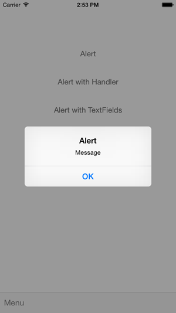
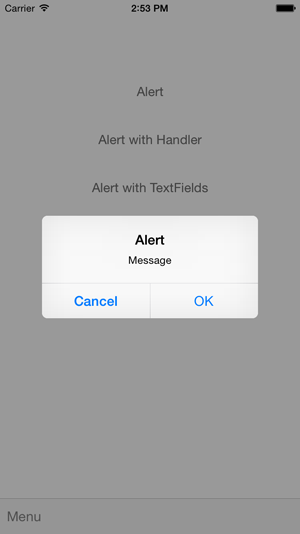
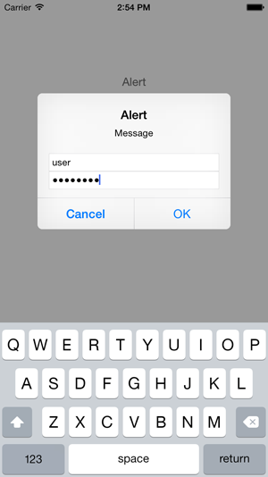
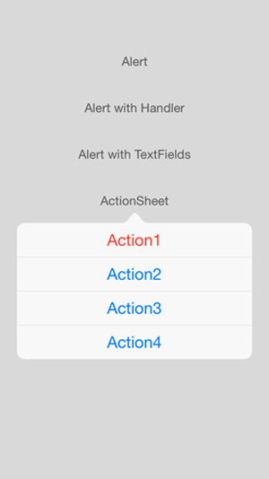
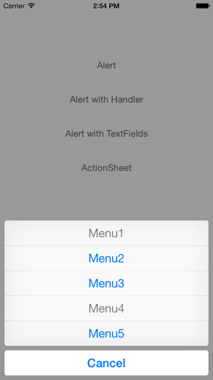
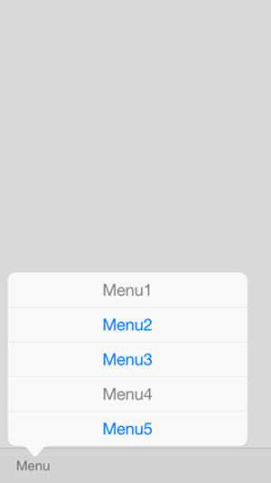

# AlertHelperKit

UIAlertController helper library in Swift

## Requirements
- Swift 3.0.1
- iOS 8.0 or later

## Installation

### Carthage

* Cartfile

```Cartfile
github "keygx/AlertHelperKit"
```
or

```Cartfile
github "keygx/AlertHelperKit" "branch-name"
```
or

```Cartfile
github "keygx/AlertHelperKit" "tag"
```

* install

```
$ carthage update
```
To integrate "AlertHelperKit.framework" into your Xcode project

### CocoaPods

* PodFile

```PodFile
source 'https://github.com/CocoaPods/Specs.git'
platform :ios, '8.0'
use_frameworks!

target '<Your Target Name>' do
    pod 'AlertHelperKit', :git => 'https://github.com/keygx/AlertHelperKit'
end
```
or

```PodFile
source 'https://github.com/CocoaPods/Specs.git'
platform :ios, '8.0'
use_frameworks!

target '<Your Target Name>' do
    pod 'AlertHelperKit', :git => 'https://github.com/keygx/AlertHelperKit', :branch => 'branch-name'
end
```
or

```PodFile
source 'https://github.com/CocoaPods/Specs.git'
platform :ios, '8.0'
use_frameworks!

target '<Your Target Name>' do
    pod 'AlertHelperKit', :git => 'https://github.com/keygx/AlertHelperKit', :tag => 'tag'
end
```

* install

```
$ pod install
```

## Usage

```
import AlertHelperKit
```

### Alert

```ViewController.swift
AlertHelperKit().showAlert(self, title: "Alert", message: "Message", button: "OK")
```



### Alert with callback handler

```ViewController.swift
let params = Parameters(
    title: "Alert",
    message: "Message",
    cancelButton: "Cancel",
    otherButtons: ["OK"]
)
    
AlertHelperKit().showAlertWithHandler(self, parameters: params) { buttonIndex in
    switch buttonIndex {
    case 0:
        println("Cancel: \(buttonIndex)")
    default:
        println("OK: \(buttonIndex)")
    }
}
```



### Alert with TextFields

```ViewController.swift
let params = Parameters(
    title: "Alert",
    message: "Message",
    cancelButton: "Cancel",
    otherButtons: ["OK"],
    inputFields: [InputField(placeholder: "username", secure: false),
                  InputField(placeholder: "password", secure: true)]
)
    
var alert = AlertHelperKit()
alert.showAlertWithHandler(self, parameters: params) { buttonIndex in
    switch buttonIndex {
    case 0:
        println("Cancel: \(buttonIndex)")
    default:
        println("OK: \(buttonIndex)")

        if let textFields = alert.textFields {
            // username
            let name: UITextField = textFields[0] as! UITextField
            if count(name.text) > 0 {
                println(name.text)
            }
            // password
            let pass: UITextField = textFields[1] as! UITextField
            if count(pass.text) > 0 {
                println(pass.text)
            }
        }
    }
}
```



### ActionSheet

```ViewController.swift
let params = Parameters(
    cancelButton: "Cancel",
    destructiveButtons: ["Action1"],
    otherButtons: ["Action2", "Action3", "Action4"],
    sender: sender,
    arrowDirection: .up
)
    
AlertHelperKit().showActionSheet(self, parameters: params) { buttonIndex in
    switch buttonIndex {
    case 0:
        println("Cancel: \(buttonIndex)")
    default:
        println("Action: \(buttonIndex)")
    }
}
```




### ActionSheet

```ViewController.swift
let params = Parameters(
    cancelButton: "Cancel",
    otherButtons: ["Menu1", "Menu2", "Menu3", "Menu4", "Menu5"],
    disabledButtons: ["Menu1", "Menu4"],
    sender: sender,
    arrowDirection: .down,
    popoverStyle: .barButton
)
    
AlertHelperKit().showActionSheet(self, parameters: params) { buttonIndex in
    switch buttonIndex {
    case 0:
        println("Cancel: \(buttonIndex)")
    default:
        println("Menu: \(buttonIndex)")
    }
}
```



## License

AlertHelperKit is released under the MIT license. See LICENSE for details.

## Author

Yukihiko Kagiyama (keygx) <https://twitter.com/keygx>

